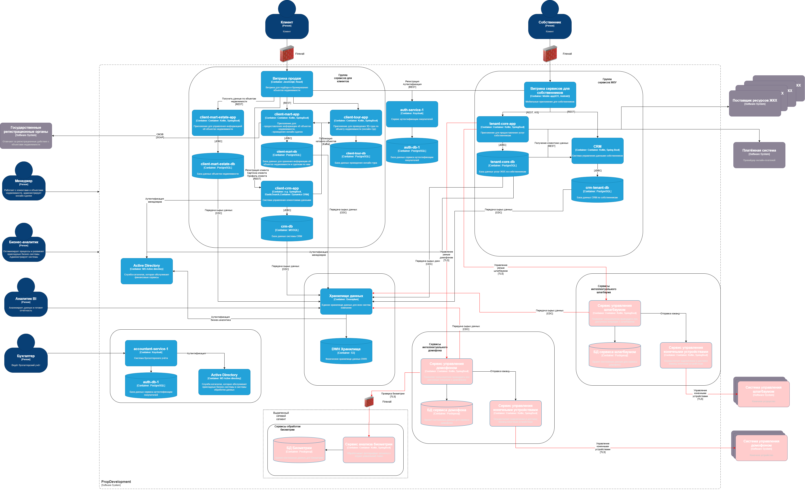

# Задание 3

## Диаграмма контекста

## Диаграмма контейнеров PropDevelopment

## Требования к интеграциям

### Требования к безопасности

1. Все внешние интеграции должны использовать протоколы шифрования для предотвращения перехвата и измененя данных.
2. Все внешние интеграции должны проходить авторизацию и аутентификацию перед получениеим доступа к данным.
3. Информация, передаваемая во внешние системы, должна быть минимально необходимой для выполнения требуемых функций.
4. Передаваемая информация должна быть обезличена.

### Протоколы аутентификации и авторизации, взаимодействие между системами предприятия и внешней платформой

 - Для аутентификации запросов передачи данных между платформами можно использовать системы API-аутентификации, такие как OAuth 2.0.
 - Платформы должны использовать TLS для передачи данных и токенов, подтверждающих аутентификацию. 
 - В качестве SSO использовать Keycloak.
